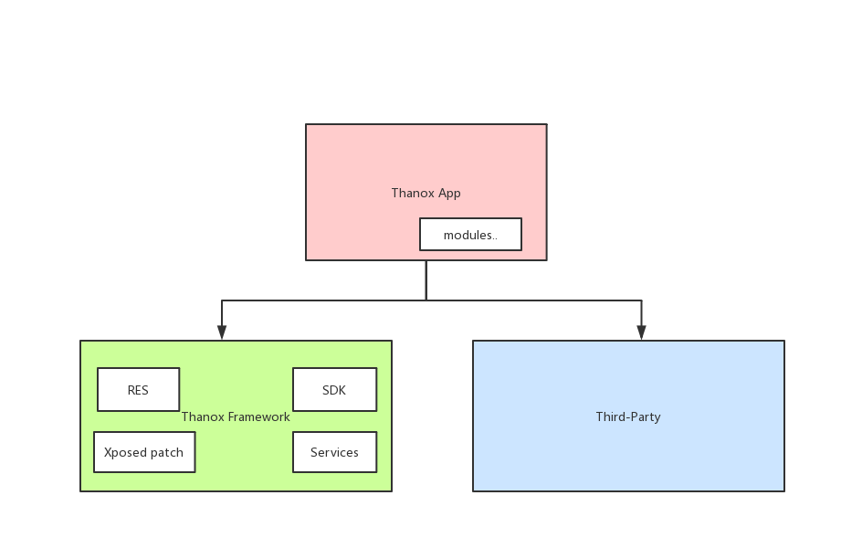

# Thanox

## CI

[](https://github.com/tornaco/thanox/actions)


## 故事

项目需求可以参考：[Project](https://github.com/Tornaco/Thanox/projects/1)

## 代码结构

**android_framework**

> Framework层sdk，services，资源与Xposed补丁模块，都是java project。

**android_sdk**

> 包含带Hidden API的android.jar，services.jar，以及Thanox sdk中定义的parcelable类，提供给android_framework各个project作为android sdk依赖。

**app**

> App工程，依赖android_framework中的thanox sdk，提供配置UI。

**module_xxx**

> App工程子模块。

**third_party**

> 三方库，适配了android.x。

## 架构




## 编译&运行

```groovy
./gradlew assembleDebug
```
